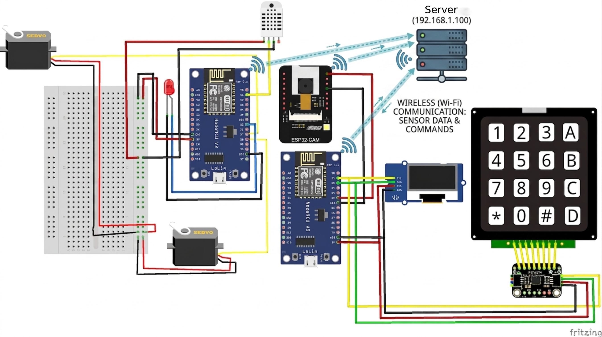

# Smart Room & Gate Access Control System

A face-recognition-based IoT access control and room automation system. The project combines an ESP32-CAM, two ESP8266 microcontrollers, and a Django backend running YOLOv8 + DeepFace to let users unlock a gate with their face (or a PIN fallback) and remotely control room fan and lighting — with admin-only controls over face enrollment and the gate password.


---

## Table of Contents

- [Overview](#overview)
- [System Architecture](#system-architecture)
- [Hardware Components](#hardware-components)
- [Features](#features)
- [User Roles](#user-roles)
- [Getting Started](#getting-started)
  - [Backend (Django) Setup](#backend-django-setup)
  - [Firmware Setup](#firmware-setup)
- [API Reference](#api-reference)
  - [Django Server Endpoints](#django-server-endpoints)
  - [ESP8266 #2 (Room Automation) Endpoints](#esp8266-2-room-automation-endpoints)
- [Access Control Flow](#access-control-flow)
- [Web & Android Apps](#web--android-apps)
- [Roadmap / Known Limitations](#roadmap--known-limitations)
- [License](#license)

---

## Overview

The system is built around three microcontroller-class devices and a central Django server:

- **ESP32-CAM** — streams live video used for face capture.
- **ESP8266 #1 (Access Control Unit)** — keypad + OLED display; triggers face verification and handles PIN fallback.
- **ESP8266 #2 (Room Automation Unit)** — drives the gate servo, fan servo, room LEDs, and reads a DHT11 temperature/humidity sensor.
- **Django backend** — performs face detection (YOLOv8) and face matching (DeepFace), manages user accounts, and exposes a REST API consumed by both microcontrollers and the web/Android apps.

## System Architecture



- **Security loop:** camera → server → ESP8266 #1 → ESP8266 #2, gated by face or PIN verification.
- **Convenience loop:** web/Android app talks directly to ESP8266 #2 for fan and light control, bypassing the server.

## Hardware Components

| Component                    | Role                                                                                                 |
| ---------------------------- | ---------------------------------------------------------------------------------------------------- |
| ESP32-CAM                    | Captures and streams live video frames for face detection and enrollment                             |
| ESP8266 #1 (Access Control)  | Keypad + OLED interface; authenticates with Django, triggers face verification, handles PIN fallback |
| ESP8266 #2 (Room Automation) | Local web server exposing gate, fan, light, and sensor control endpoints                             |
| 4x4 Matrix Keypad + PCF8574  | Manual PIN entry via I2C GPIO expansion                                                              |
| SSD1306 OLED Display         | Shows system status, verification results, and PIN entry feedback                                    |
| DHT11 Sensor                 | Room temperature and humidity for automatic fan control                                              |
| Gate Servo                   | Actuates the gate lock/latch mechanism                                                               |
| Fan Servo                    | Drives the fan on/off actuator                                                                       |
| Blue / Yellow LEDs           | Room light ON/OFF indicators                                                                         |

## Features

- 🎯 **Face-recognition gate entry** using YOLOv8 for detection and DeepFace for matching
- 🔢 **PIN fallback** via a physical keypad if face verification fails
- 🌡️ **Automatic fan control** based on a configurable temperature threshold (with hysteresis)
- 💡 **Remote light and fan control** from a web dashboard and Android app
- 🚪 **Auto-closing gate** (5-second timer) with no separate close request needed
- 🔐 **Role-based access** — only the admin account can enroll/delete faces or change the gate password
- 📶 **Session-based authentication** shared between the Django server and both ESP8266 units

## User Roles

| Capability                          | Admin Account |  Regular User   |
| ----------------------------------- | :-----------: | :-------------: |
| Open gate via face recognition      |      ✅       |       ✅        |
| Open gate via keypad PIN            |      ✅       | ✅ (shared PIN) |
| Control fan / light (web & Android) |      ✅       |       ✅        |
| Enroll a new face                   |      ✅       |       ❌        |
| Delete a face / reset database      |      ✅       |       ❌        |
| Update the gate password            |      ✅       |       ❌        |

## Getting Started

### Backend (Django) Setup

**Requirements:** Python 3.9+, MySQL/MariaDB (or your configured DB), a webcam-compatible MJPEG stream URL.

```bash
# Clone the repository
git clone https://github.com/<your-username>/<your-repo>.git
cd <your-repo>/server

# install uv
pip install uv
```

Configure your database and camera settings (e.g. in `settings.py` or a `.env` file):

```python
CAMERA_URL = "http://<esp32-cam-ip>"
CONTROL_SERVER_URL = "http://<esp8266-2-ip>/"
```

Run database migrations and start the server:

```bash
python -m uv run manage.py migrate
python -m uv run manage.py runserver 0.0.0.0:8000
```

The YOLOv8 face model (`yolov8n-face.pt`) is loaded automatically from the `models/` directory on first run.

### Firmware Setup

Both ESP8266 sketches are written for the **Arduino IDE** (or PlatformIO) targeting the ESP8266 board package.

1. Install required libraries: `ESP8266WiFi`, `ESP8266HTTPClient`, `ESP8266WebServer`, `ArduinoJson`, `Adafruit_GFX`, `Adafruit_SSD1306`, `I2CKeyPad`, `Servo`, `DHT sensor library`.
2. Update the Wi-Fi credentials and server URLs at the top of each `.ino` file:
   ```cpp
   const char* ssid = "<your-wifi-ssid>";
   const char* password = "<your-wifi-password>";
   String server_url = "http://<django-server-ip>:8000/";
   String second_esp_url = "http://<esp8266-2-ip>/";
   ```
3. Flash `esp8266_access_control` to ESP8266 #1 and `esp8266_room_automation` to ESP8266 #2.
4. Flash the standard ESP32-CAM web server firmware (e.g. `CameraWebServer` example) to the ESP32-CAM, pointed at the same network.

## API Reference

### Django Server Endpoints

| Endpoint                                     | Method    | Access        | Description                                         |
| -------------------------------------------- | --------- | ------------- | --------------------------------------------------- |
| `/`                                          | GET       | Authenticated | Main dashboard                                      |
| `/controls/`                                 | GET       | Authenticated | Room controls page (fan/light/gate)                 |
| `/login/`                                    | GET, POST | Public        | Authenticate and start a session                    |
| `/signup/`                                   | GET, POST | Public        | Register a new user account                         |
| `/logout/`                                   | GET       | Authenticated | Flush the current session                           |
| `/get_updated_password/?username={username}` | GET       | Authenticated | Retrieve the current gate PIN                       |
| `/update_password/`                          | POST      | Admin only    | Update the gate password                            |
| `/faces/{name}/`                             | POST      | Admin only    | Capture a frame and enroll a new face               |
| `/faces/{name}/`                             | DELETE    | Admin only    | Delete a specific user's face data                  |
| `/faces/`                                    | DELETE    | Admin only    | Delete **all** enrolled faces                       |
| `/verify/?threshold={value}`                 | GET       | Authenticated | Capture a frame and match it against enrolled faces |

### ESP8266 #2 (Room Automation) Endpoints

| Endpoint                     | Method | Description                                                          |
| ---------------------------- | ------ | -------------------------------------------------------------------- |
| `/gate_open`                 | GET    | Opens the gate; auto-closes after 5 seconds                          |
| `/mode?state={auto\|manual}` | GET    | Switches fan control mode                                            |
| `/turn_on_light`             | GET    | Turns the room light ON                                              |
| `/turn_off_light`            | GET    | Turns the room light OFF                                             |
| `/fan?state={on\|off}`       | GET    | Manually sets the fan state                                          |
| `/sensors`                   | GET    | Returns current temperature and humidity                             |
| `/status`                    | GET    | Returns full system status (mode, light, fan, gate, sensor readings) |

## Access Control Flow

1. ESP8266 #1 logs in to Django on boot and syncs the current gate PIN.
2. Pressing **A** on the keypad triggers `GET /verify/`. On a `"success"` response, ESP8266 #1 calls ESP8266 #2's `/gate_open`.
3. If face verification fails, the user can enter a PIN on the keypad; pressing **#** checks it against the synced PIN and opens the gate on a match.
4. The gate auto-closes 5 seconds after opening — no separate close command is required.

## Web & Android Apps

- **Fan / light / gate control** — sent directly to ESP8266 #2, available to any authenticated user.
- **Face enrollment, face deletion, and gate password updates** — routed through the Django server and restricted to the `admin` account.
- **Face-based gate entry** — available to any enrolled user via `/verify/`.

## Roadmap / Known Limitations

- [ ] Encrypt stored gate passwords instead of plaintext comparison
- [ ] Move hardcoded Wi-Fi/admin credentials in firmware to a config file or provisioning flow
- [ ] Add HTTPS/session hardening between ESP8266 units and the Django server
- [ ] Wire automatic light/fan activation into the gate-open sequence (currently commented out)
